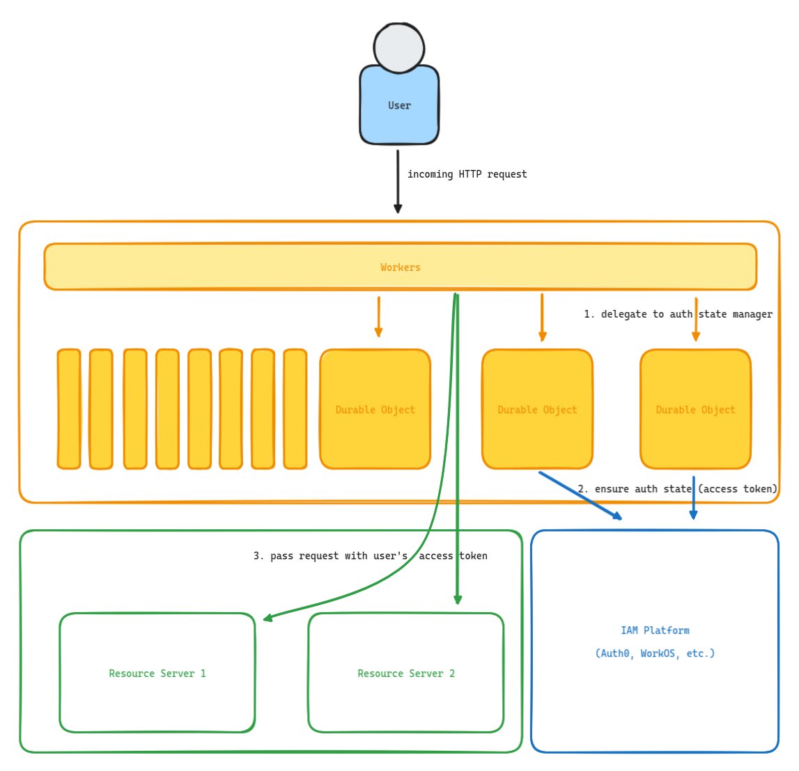

# edge-oauth-sessions

This project defines the basis for edge-based authentication state management with support for OpenID Connect compliant authorization server.

As an initial target, this is using SDKs for Auth0 and WorkOS to prove out the concept.

## What is it, precious?

This project shifts the _authentication_ component of your web applications, whether they are single-page applications or traditional web servers, out to the edge.

## Architecture

## How it works

> ℹ️ Currently, in order to use edge-oauth-sessions, you need to be using Cloudflare.

The Cloudflare worker defines several endpoints, and a catch-all that proxies your downstream traffic.

By sitting in front of your traffic, and providing a proxy to all of your downstream applications, the worker can ensure that authentication state is provided in all downstream requests.

This also can take care of automatic access token refreshes during client requests, and can even be configured to ensure that refreshes are atomically performed with the use of Durable Objects.

## Security

On the client-side, the user's will only have a _secure, HTTP-only_ cookie set locally. This protects any potential manipulation of cross-site scripting (XSS).

The server-side maintains state in a per-session Durable Object that exists solely for that user.

If a user's region changes, a silent, client-side re-authentication will be performed, since the Durable Object is partitioned by region. The new Durable Object receives the new session, where the user can continue to interact as long as they maintained a session with the authorization server or approved their authentication request.
