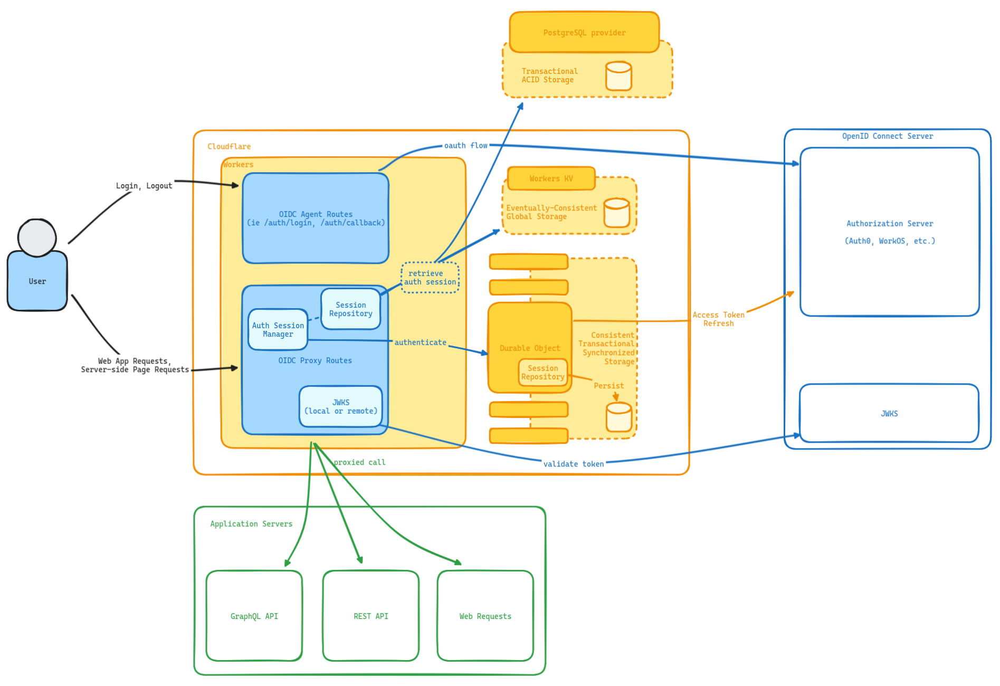

# edge-oauth-sessions

This project defines the basis for edge-based authentication state management with support for OpenID Connect compliant authorization server.

As an initial target, this is using SDKs for Auth0 and WorkOS to prove out the concept.

## What is it, precious?

This project shifts the _authentication_ component of your web applications, whether they are single-page applications or traditional web servers, out to the edge.

The project follows the spirit of [the Token Handler pattern](https://bff-patterns.com/patterns/api-token-handler), which centers around housing the auth mechanism inside of your API Gateway.

## Status

This project is definitely a work in-progress. It builds on experience running Cloudflare Workers in front of all production traffic and incorporates technology specific to Cloudflare. The following list covers the general state of the software:

| Status | Feature                        | Description                                                                         |
| ------ | ------------------------------ | ----------------------------------------------------------------------------------- |
| ✅     | Gateway / Proxy                | The capability to pass downstream traffic                                           |
| 🚧     | OAuth Session Management(OASM) | Managing OAuth token, refreshing, and injecting state                               |
| 🚧     | Durable Object Session State   | Managing Session State backed by Durable Object's persistent, transactional storage |
| 🚧     | Workers KV Session State       | Managing Session State backed by eventually-consistent global KV storage            |
| 🚧     | NeonDB Session State           | Managing Session State backed by transactional, serverless PostgreSQL storage       |
| 🚧     | Auth0 Provider                 | Session Management backed by Auth0                                                  |
| 🚧     | WorkOS Provider                | Session Management backed by WorkOS                                                 |
| 🚧     | OpenID Connect Provider        | Session Management backed by generic OpenID Connect providers                       |
| 🚧     | Login / Logout Routes          | Routes for orchestrating login and logout with OIDC providers                       |
| ✅     | Geolocation                    | The ability to detect geolocation headers and proxy them                            |
| ✅     | Bot scores                     | The ability to detect bot score headers and proxy them                              |
| ✅     | Captcha                        | The ability to detect captcha headers and enforce it                                |
| 🚧     | CSRF Protection                | Protected against cross-site request forgery attacks                                |
| 🤔     | JWKS Validation                | Validation of JWTs against a JSON Web Key Set (local or remote)                     |

## Architecture

## How it works

> ℹ️ Currently, in order to use edge-oauth-sessions, you need to be using Cloudflare.

The Cloudflare worker defines several endpoints, and a catch-all that proxies your downstream traffic.

By sitting in front of your traffic, and providing a proxy to all of your downstream applications, the worker can ensure that authentication state is provided in all downstream requests.

This also can take care of automatic access token refreshes during client requests, and can even be configured to ensure that refreshes are atomically performed with the use of Durable Objects.

## Security

On the client-side, the user's will only have a _secure, HTTP-only_ cookie set locally. This protects any potential manipulation of cross-site scripting (XSS).

The server-side maintains state in a per-session Durable Object that exists solely for that user.

If a user's region changes, a silent, client-side re-authentication will be performed, since the Durable Object is partitioned by region. The new Durable Object receives the new session, where the user can continue to interact as long as they maintained a session with the authorization server or approved their authentication request.
